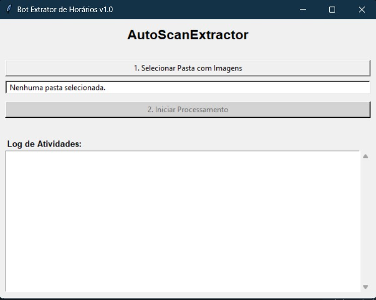

# AutoScanExtractor 🤖

> Ferramenta de automação em Python e Tkinter que utiliza OCR (Tesseract) para extrair dados de imagens e os estrutura em arquivos .xlsx usando Pandas.

Este projeto foi criado como parte de um portfólio de desenvolvimento, demonstrando habilidades em automação de processos (RPA), reconhecimento óptico de caracteres (OCR) e desenvolvimento de interfaces gráficas.



---

## 📖 Sobre o Projeto

Este projeto resolve o problema da extração manual de dados de imagens, como cronogramas, cardápios, listas de presença ou relatórios digitalizados.

Em vez de um usuário digitar manualmente as informações de centenas de imagens em uma planilha, este bot automatiza todo o processo:

1.  O usuário seleciona uma pasta através de uma interface gráfica simples.
2.  O bot varre a pasta em busca de arquivos de imagem (JPG, PNG, etc.).
3.  Ele utiliza a engine Tesseract OCR para "ler" o texto de cada imagem.
4.  O texto extraído é processado para identificar e estruturar os dados relevantes (neste exemplo, dias, refeições e horários).
5.  Todos os dados encontrados são consolidados e salvos em um único arquivo Excel (`.xlsx`) na mesma pasta.

## 🚀 Funcionalidades Principais

* **Interface Gráfica (GUI):** Criada com `Tkinter` para ser intuitiva e fácil de usar.
* **Seleção de Pasta:** Permite ao usuário escolher qualquer diretório do seu computador.
* **Processamento em Lote:** Processa múltiplos arquivos de imagem de uma só vez.
* **Extração com OCR:** Utiliza `Tesseract` para reconhecer texto em português.
* **Estruturação de Dados:** Usa `Pandas` para organizar os dados extraídos em um formato de tabela.
* **Exportação para Excel:** Gera um arquivo `.xlsx` limpo e organizado.
* **Log de Atividades:** Mostra o status do processamento em tempo real na interface.

## 🛠️ Tecnologias Utilizadas

* **[Python 3](https://www.python.org/)**
* **[Tkinter](https://docs.python.org/3/library/tkinter.html)** - (Biblioteca nativa do Python) Para a interface gráfica.
* **[Tesseract OCR](https://github.com/tesseract-ocr/tesseract)** - A engine principal de reconhecimento de caracteres.
* **[Pytesseract](https://pypi.org/project/pytesseract/)** - O "wrapper" Python para se comunicar com o Tesseract.
* **[Pandas](https://pandas.pydata.org/)** - Para manipulação e exportação dos dados.
* **[Pillow (PIL)](https://python-pillow.org/)** - Para abrir e manipular os arquivos de imagem.
* **[Openpyxl](https://pypi.org/project/openpyxl/)** - Dependência do Pandas para escrever arquivos `.xlsx`.

---

## 🏁 Como Usar

Para executar este projeto localmente, siga os passos abaixo.

### 1. Pré-requisitos

Você **precisa** ter o Tesseract OCR Engine instalado no seu sistema (o script Python apenas "chama" esse programa).

* **Windows:** Baixe e instale [a partir deste link](https://github.com/UB-Mannheim/tesseract/wiki).
    * **Importante:** Durante a instalação, na tela "Choose Components", certifique-se de marcar o suporte ao idioma "Portuguese" (em `Additional language data`).
* **macOS:** `brew install tesseract tesseract-lang`
* **Linux:** `sudo apt-get install tesseract-ocr tesseract-ocr-por`

### 2. Instalação

1.  Clone o repositório:
    ```bash
    git clone https://github.com/alessandrolsdev/AutoScanExtractor.git
    ```
2.  Navegue até a pasta do projeto:
    ```bash
    cd AutoScanExtractor
    ```
3.  Crie um arquivo chamado `requirements.txt` na raiz do projeto e cole o seguinte conteúdo:
    ```
    pandas
    pillow
    pytesseract
    openpyxl
    ```
4.  (Recomendado) Crie um ambiente virtual:
    ```bash
    python -m venv venv
    ```
    E ative-o:
    * Windows: `.\venv\Scripts\activate`
    * Mac/Linux: `source venv/bin/activate`
    
5.  Instale as dependências:
    ```bash
    pip install -r requirements.txt
    ```

### 3. Executando o Bot

Com as dependências e o Tesseract instalados, basta executar o script principal:

```bash
python bot_com_interface.py
```

A interface gráfica será aberta. Use os botões para selecionar sua pasta de imagens e iniciar o processamento.

## 📝 Licença

Este projeto está sob a licença MIT. Veja o arquivo `LICENSE` (que você pode adicionar ao repositório) para mais detalhes.

---

Feito por **[Alessandro Lima da Silva]** - [https://github.com/alessandrolsdev]